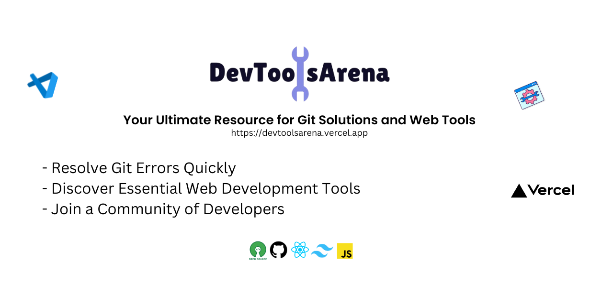

# DevToolsArena - Your Ultimate Resource for Git Solutions, Web Tools, and More

## Why DevToolsArena?

DevToolsArena is your comprehensive platform for not only resolving Git-related issues but also exploring a variety of web development resources, tools, and insights. Whether you're troubleshooting Git errors, seeking valuable tools, or diving into web development topics, DevToolsArena is designed to be your go-to resource.

Our platform provides a collaborative space where users can find solutions to common Git errors, discover essential web tools, and access a wealth of web development resources. It’s a valuable destination for both seasoned developers and newcomers looking to enhance their skills and streamline their workflows.

## Tech Stack

| Language   | Badge                                                                                                             |
| ---------- | ----------------------------------------------------------------------------------------------------------------- |
| HTML       |                   |
| CSS        |                      |
| Tailwind   |  |
| JavaScript |  |
| React      |                |
| Vite       |                   |

## How to Contribute

Contributing to DevToolsArena is a great way to get involved and make an impact. Here’s how you can contribute:

- **Review the [Code of Conduct](/CODE_OF_CONDUCT.md)** to understand our community guidelines.
- **Follow the [Contribution Guidelines](/contributing.md)** to get started.
- **Report issues** or **suggest features** by creating an issue on GitHub.

## Join Our Community

Connect with other developers and enthusiasts through our community channels. Joining a community can provide you with valuable insights, support, and networking opportunities.

[Join our Discord community](https://discord.gg/xwRbDwnbMr)

### Acknowledgments

We extend our heartfelt thanks to everyone who has contributed to DevToolsArena. Your support and contributions are invaluable to the success of this project. ❤️

## License

DevToolsArena is licensed under the [GNU General Public License](/LICENSE).
